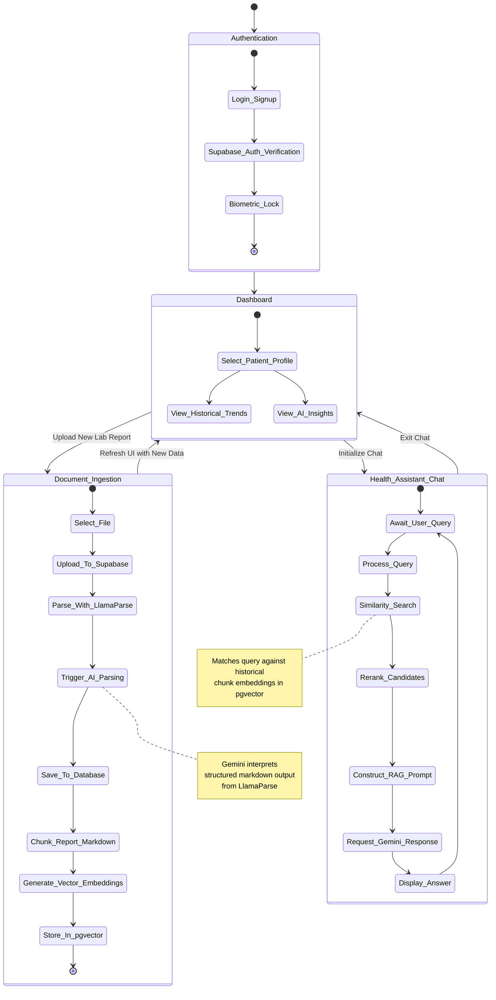

# Clear Health (LabSense) Workflow & Data Flow Diagrams

This document illustrates the core workflows and data architecture of the application, encompassing Authentication, Document Processing, Trend Analysis, and AI-powered interactions.

## 1. High-Level System Workflow

This flowchart demonstrates how users navigate the system and how modules interact with our remote services (Supabase & Gemini AI).

```mermaid
graph TD
    User([User])
    
    subgraph Auth Flow
        User -->|Log in / Sign up| Auth[Supabase Auth]
        Auth -->|Biometric Check| BioAuth[Local Biometrics via local_auth]
    end

    BioAuth --> AppHome[App Dashboard]

    subgraph Document Processing Flow
        AppHome -->|Upload Report| UploadLab[Upload Lab PDF/Image]
        UploadLab -->|Store File| SupabaseStorage[(Supabase Storage)]
        SupabaseStorage -->|Create Ingestion Job| IngestionQueue[(ingestion_jobs queue)]
        IngestionQueue -->|Worker retries/dead-letter| EdgeWorker[Edge Processing Worker]
        UploadLab -->|Parse PDF to Markdown| LlamaParse[LlamaParse]
        LlamaParse -->|Extract Structured Metrics| GeminiExtract[Gemini Data Extraction]
        GeminiExtract -->|Save Structured Metrics| SupabaseDB[(Supabase PostgreSQL)]
        GeminiExtract -->|Chunk + Embed| NemotronEmbed[Nemotron Embed (2048)]
        NemotronEmbed -->|Store Chunk Vectors| PGVector[(pgvector Table)]
        SupabaseDB -.->|Offline Sync| Hive[(Local Hive DB)]
    end

    subgraph AI Chat & RAG Flow
        AppHome -->|Ask Medical Question| ChatUI[AI Health Chat]
        ChatUI -->|Embed Query| VectorSearch[Nemotron Query Embedding]
        VectorSearch -->|Fetch Top-20| PGVector
        PGVector -->|Rerank Candidates| Reranker[Nemotron Reranker]
        Reranker -->|Top Context Chunks| RAGPrompt[RAG Prompt Assembly]
        RAGPrompt -->|Ask LLM| GeminiChat[Gemini AI]
        GeminiChat -->|Contextual Answer| ChatUI
    end

    subgraph Analytics & Trends
        AppHome -->|View Dashboards| DashUI[Trend Charts]
        SupabaseDB -->|Load Historical Data| DashUI
        DashUI -->|Generate Smart Summaries| GeminiInsight[Gemini Insights]
        GeminiInsight -->|Display Actionable Tips| DashUI
    end
```

## 2. Detailed Process State Diagram

This state diagram depicts the step-by-step state transitions of the app for the primary user journeys.



